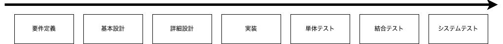
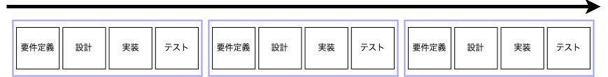
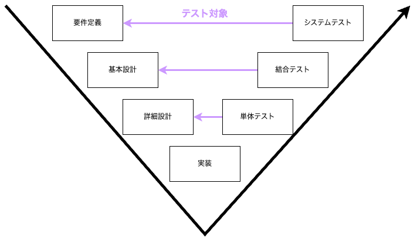
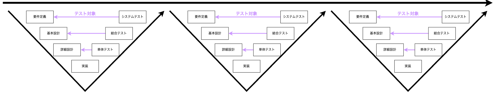

# ソフトウェア開発の全体像

ソフトウェア開発の工程や開発手法に触れることで、この研修でどの工程や段階をこなせるようになるのかを把握しましょう。ここではウォータフォールとアジャイルの２つの開発手法と、V字モデルに関して触れていきます。

 

## ウォーターフォールとアジャイル開発

### ウォーターフォールとは

ウォーターフォールモデルは、直線的で順番に進むプロセスを採用したソフトウェア開発アプローチで、各段階が完了してから次の段階に進みます。このモデルは、計画性と予測可能性を重視し、変更が少ないと予期されるプロジェクトに適しています。

 

 

プロジェクトの大きさによりますが、上記のプロセス全体を３ヶ月以上費やしてリリースまで遂行します。またウォーターフォールモデルでは、ドキュメントはプロジェクトの進行において非常に重要な役割を果たします。プロジェクトの各段階（要件定義、基本設計、詳細設計、実装、テスト）は、前段階のドキュメントに基づいて進行するため、明確で詳細なドキュメントが必要です。これにより、プロジェクトの全体像を把握し、後の段階での混乱を避けることができます。

- ***要件定義***: 　　　　システムが満たすべき機能や条件を特定します。
- ***基本設計***: 　　　　システムの全体構造やデータモデルを設計します。
- ***詳細設計***: 　　　　システムの具体的な内部ロジックやインターフェースを定義します。
- ***実装***: 　　　　　　システムのソースコードを書き、機能を作成します。
- ***単体テスト***: 　　　個々のコンポーネントが正しく機能するかを検証します。
- ***結合テスト***: 　　　複数のコンポーネントを組み合わせて動作するかを確認します。
- ***システムテスト***: 　完成したシステムが全体として要件を満たすかをテストします。

 

一般的に全工程の中の要件定義〜詳細設計を上流工程、実装〜システムテストを下流工程と呼びます（もちろん相対的な言葉なのでこの定義は厳密ではありません）。

### ウォータフォールのメリット・デメリット

***メリット***

- 順序立てられたフェーズにより、プロジェクトの管理が容易であり、スケジュールや予算の管理がしやすい。

***デメリット***

- 初期段階で要件を固定するため、プロジェクトの途中での変更が困難であり、変更に対応しにくい。

上記の理由によりウォーターフォールは、市場に似たような事例が多く仕様を予め決めやすいプロダクト開発に採用される傾向にあります。建設業や製造業、医療業界では予算やスケジュールの管理がより厳格であることと安全基準や規制遵守の観点からウォーターフォールがより好まれます。

 

### アジャイル開発とは

アジャイル開発とは、柔軟性と顧客との継続的なコラボレーションに焦点を当てた反復的なソフトウェア開発アプローチです。これにより、変更に迅速に対応し、頻繁に価値あるソフトウェアをリリースすることを可能にします。

 

 

上記の「要件定義・設計・実装・テスト」の１つあたりをスプリントと呼び、通常スプリントごとにリリースを行います。プロジェクトによりますが、１スプリントあたり１週間ほどの比較的短い期間で、複数のスプリントを繰り返すことで徐々にプロダクトの機能拡張や修正を遂行していきます。

またアジャイル開発ではドキュメントも重要ですが、その取り扱い方には柔軟性があり、必要最小限のドキュメントに焦点を当てることが多いです。アジャイルは変更に迅速に対応し、継続的な顧客のフィードバックに基づいて製品を進化させることを重視するため、過度なドキュメントはプロセスの迅速さを損なう可能性があります

### アジャイルのメリット・デメリット

***メリット***

- 変更に対して柔軟に対応できるため、プロジェクトの途中で要件が変わっても適応しやすい、要件を変えやすい。

***デメリット***

- 変更が頻繁に行われるため、プロジェクトの最終的なスケジュールやコストが不確実になることがある。

上記の理由によりアジャイル開発は、似たような既存事業がない（世の中に十分な事例がない）場合や、プロダクトを市場に出してみないとどのような機能が必要なのかわからない場合などに採用される傾向があります。toCのソフトウェア開発などでは、市場の要求変化が激しいことと、製造業や建設業に比べて変更によるコストが低いことを鑑みてアジャイル開発が好まれるケースが多いです。

 

## V字モデル

V字モデルとは各工程を開発工程とテスト工程に分けて、それぞれの工程の対応を表した図です。開発過程とテスト過程を対比させることで、各テストの対象範囲を明確にすることができます。

### ウォータフォールにおけるV字モデル

ウォーターフォールの工程全体をV字モデルで表すと以下のようになります。

時間軸で見るとV字の左上の要件定義から始まり、右上のシステムテストで終わります。V字で表現することで、システムテストが製品が要件定義を満たせているか検証するためのテストであること、結合テストが製品が基本設計を満たせているか確認するテストであること、単体テストが製品が詳細設計を満たせているか確認するテストであることが明確になります。

### アジャイルにおけるV字モデル

アジャイルは以下のようにV字モデルを繰り返します。

アジャイルでは１つのスプリント内で１つのV字モデルを遂行します。それぞれのテスト対象を明確にしたV字モデルを短い期間で繰り返すことで品質を確保しながら機能の拡張を目指します。

 

## まとめ

ウォータフォールとアジャイルといった２つの開発手法と、開発段階とテスト段階のそれぞれの対応をまとめたV字モデルというものを紹介しました。ウォーターフォールとアジャイルは優劣をつけられるものではありません。長所短所を考慮して適切に選択したり、場合によっては両者を組み合わせて運用するケースも考えられます（例えばMVPリリースまではウォーターフォール、運用・保守はアジャイルなど）。また今回の研修では主に、上記の中の「実装」の部分を扱っていきます（一部、詳細設計単体テストも含みます）。

